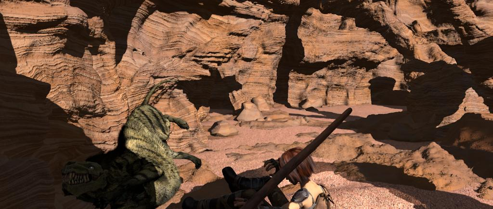
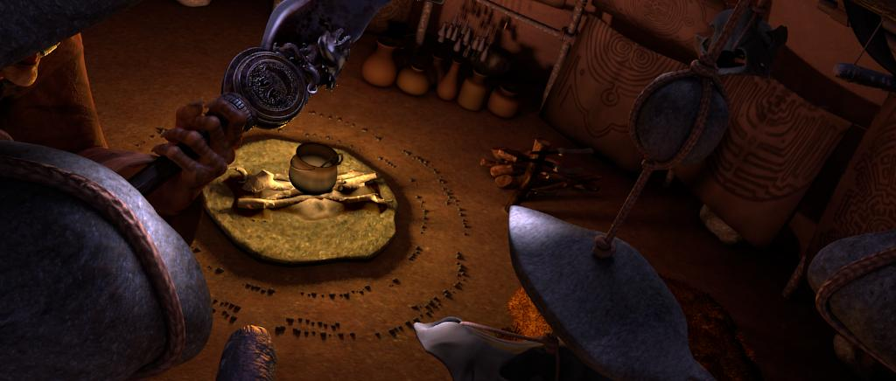

# Depth estimation from 4D light field videos
**Takahiro Kinoshita** and **Satoshi Ono**  
*Kagoshima University*  

[**[Paper]**](https://arxiv.org/abs/2012.03021)
[**[Code]**](https://github.com/mediaeng-lfv/LFV_Disparity_Estimation)
[**[Dataset]**](https://ieee-dataport.org/open-access/sintel-4d-light-field-videos-dataset)

---

## Abstract
Depth (disparity) estimation from 4D Light Field (LF) images
has been a research topic for the last couple of years.
Most studies have focused on depth estimation from static 4D LF images
while not considering temporal information, i.e., LF videos.
This paper proposes an end-to-end neural network architecture 
for depth estimation from 4D LF videos.
This study also constructs a medium-scale synthetic 4D LF video dataset that 
can be used for training deep learning-based methods.
Experimental results using synthetic and real-world 4D LF videos 
show that temporal information contributes to the improvement of 
depth estimation accuracy in noisy regions.

---

## Our Example Results
### Synstic data
  
### Real-world data
  

---

## Our Dataset [[available at IEEE DataPort]](https://ieee-dataport.org/open-access/sintel-4d-light-field-videos-dataset)  
  

In order to evaluate the performance of 4D LFVs depth estimation methods, 
we developed the Sintel 4D LFV dataset from the open-source movie *Sintel*.
It is difficult to accurately evaluate the effectiveness of 
deep learning-based 4D LFVs depth estimation methods 
in existing available 4D LFV datasets
due to small number of samples or no ground-truth disparity values is available.

The generated dataset consists of 23 synthetic 4D LFVs 
with 1,204x436 pixels, 9x9 views, and 20--50 frames, 
and has ground-truth disparity values in the central view, 
so that can be used for training deep learning-based methods.
Each scene was rendered with a *clean* pass 
after modifying the production file of *Sintel* 
with reference to [the MPI Sintel dataset](http://sintel.is.tue.mpg.de/).
A *clean* pass includes
complex illumination and reflectance properties including specular reflections,
such as smooth shading and specular reflections,
while bokeh, motion blur, and semi-transparent objects are excluded.

The 4D LFVs were captured by moving the camera
with a baseline of 0.01m
towards a common focus plane while keeping the optical axes parallel.
A ground-truth disparity value was obtained by transforming 
the depth value obtained in Blender.
The disparity values are in the range [0, 1] for most scenes, 
but up to 1.5 for some scenes.

### Scenes
[**GIF version page is here**](./gif_scenes_page). (**Note** that there are many large size GIFs.)

| Scene name    | Frames | Maximum disparity | RGB                                                | Disparity                                              |
|---------------|--------|-------------------|----------------------------------------------------|--------------------------------------------------------|
| ambushfight_1 | 20     | 0.366             |  |  |
| ambushfight_2 | 21     | 1.522             |  |  |
| ambushfight_3 | 41     | 1.110             |  |  |
| ambushfight_4 | 30     | 1.005             |  |  |
| ambushfight_5 | 50     | 0.419             |  |  |
| ambushfight_6 | 20     | 0.562             |  |  |
| bamboo_1      | 50     | 0.230             |       |       |
| bamboo_2      | 50     | 0.820             |       |       |
| bamboo_3      | 50     | 0.592             |       |       |
| chickenrun_1  | 50     | 1.005             |   |   |
| chickenrun_2  | 21     | 0.485             |   |   |
| chickenrun_3  | 50     | 0.270             |   |   |
| foggyrocks_1  | 50     | 0.191             |   |   |
| foggyrocks_2  | 50     | 0.493             |   |   |
| questbegins_1 | 40     | 0.882             |  |  |
| shaman_1      | 50     | 2.148             |       |       |
| shaman_2      | 50     | 1.191             |       |       |
| shaman_3      | 50     | 0.954             |       |       |
| shaman_b_1    | 50     | 1.348             |     |     |
| thebigfight_1 | 50     | 0.620             |  |  |
| thebigfight_2 | 50     | 0.302             |  |  |
| thebigfight_3 | 50     | 0.317             |  |  |
| thebigfight_4 | 50     | 0.233             |  |  |
